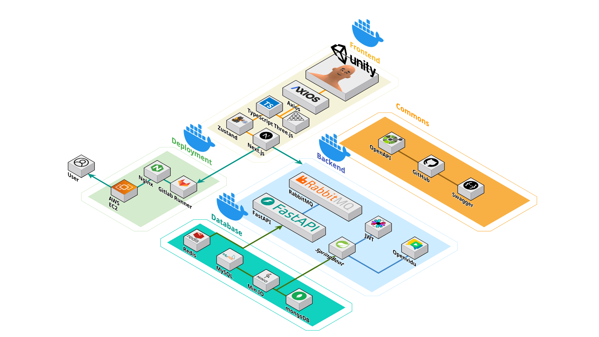

# 🎸 딩가딩 (Ding-Ga-Ding) 프로젝트

> 🎵 AI 음성 인식 기반의 연주 실력 측정 및 밴드 구인구직 플랫폼

## 📋 프로젝트 소개

딩가딩은 음성인식 AI를 통해 사용자의 연주 실력을 분석하고 티어를 측정하여, 실력에 맞는 밴드를 찾을 수 있도록 도와주는 서비스입니다. 더 나아가 라이브하우스 기능을 통해 실시간으로 다른 연주자들과 소통하고 함께 연주할 수 있는 환경을 제공합니다.

## 🎯 핵심 목표

1. **🔍 정확한 밴드 구인구직 매칭**
- 실력 기반의 구인구직으로 적합한 밴드원 찾기
- 라이브하우스, 채팅 등을 통한 쉬운 구인구직 프로세스

2. **🏆 실력 측정을 통한 사용자 동기 부여**
- AI 기반 연주 평가 시스템 (비트감, 음정, 톤)
- 티어 시스템을 통한 실력 향상 동기 부여

3. **🤝 커뮤니티 활성화**
- 라이브하우스를 통한 실시간 연주 및 소통
- 팔로우 시스템으로 연주자 간 네트워크 형성

## 프로젝트 아키텍처

## 🚀 주요 기능

### 📊 실력 측정 시스템

- **💯 랭크 게임**: 특정 곡을 연주하여 실력 측정
- **🏅 티어 시스템**: IRON, BRONZE, SILVER, GOLD, PLATINUM, DIAMOND 등급으로 구분
- **📈 점수 분석**: 비트감(Beat), 음정(Tune), 톤(Tone) 세 가지 요소 평가

### 👥 밴드 및 구인구직

- **👨‍🎤 밴드 생성 및 관리**: 본인의 밴드 생성 및 멤버 관리
- **🔎 맞춤형 구인**: 필요한 악기와 티어를 지정하여 멤버 모집
- **📅 오디션 일정 관리**: 오디션 날짜와 곡 선정

### 🏠 라이브하우스

- **🎭 실시간 연주**: 최대 인원 설정, 연주자/관객 역할 선택
- **🎬 연주자 기능**: 음성 스트리밍, 악기별 GLB 모델 및 애니메이션
- **👏 관객 기능**: 리액션 이모티콘, 관람 기능
- **👮 방장 관리 기능**: 참가자 강제 퇴장, 공개/비공개 설정

## 🛠️ 기술 스택

### 백엔드
- **☕ Java/Spring Boot**: 서버 API 구현
- **🗄️ MySQL**: 데이터베이스
- **📝 OpenAPI 3.0**: API 문서화

### 프론트엔드
- **⚛️ React**: 사용자 인터페이스
- **🎨 THREE.js**: 3D 환경 구현

### 유니티
- **🎨Unity**: 3D 모델링 구축

### 인프라
- **☁️ AWS**: 클라우드 서비스
- **🔄 CI/CD**: 지속적 통합 및 배포

## 📦 데이터 모델

주요 엔티티:
- 👤 Member: 사용자 정보
- 🎵 Song: 곡 정보
- 🎸 Band: 밴드 정보
- 📢 BandRecruitment: 밴드 구인 정보
- 🏆 MemberRank: 사용자 티어 정보
- 🏠 Livehouse: 라이브하우스 정보

## 👥 팀원 정보

- 박준호 - Backend, Infra
- 김나율 - Backend
- 이종화 - AI
- 박태건 - Unity
- 김민수 - Frontend
