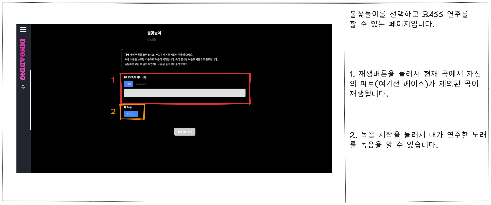

# 음악 앱 UI 문서

## 0. 네비게이션 바

## 1. 메인페이지

## 2. 악기 선택-도전모드

## 3. 티어선택

## 4. 티어 악기 선택

## 5. 노래연주

## 6. 연주결과확인

## 7. 최종결과확인-성공

## 8. 라이브하우스 목록 확인

## 9. 라이브 하우스 생성하기

## 10. 라이브하우스 상세페이지

## 11. 밴드 목록

## 12. 밴드 상세페이지
